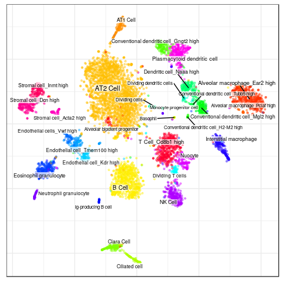
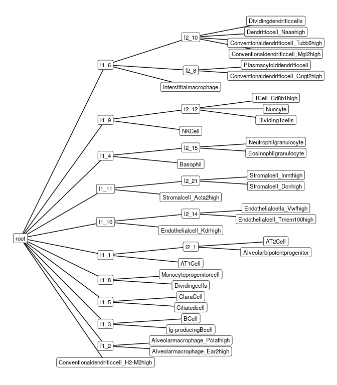
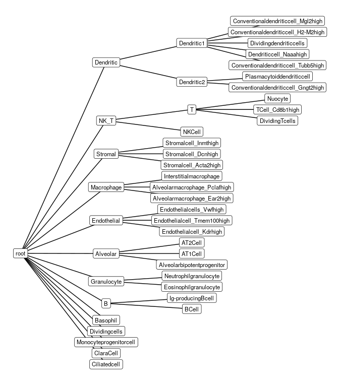
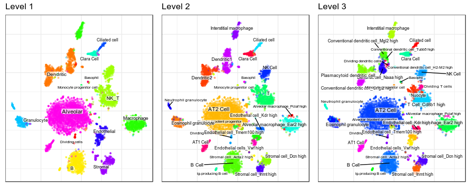
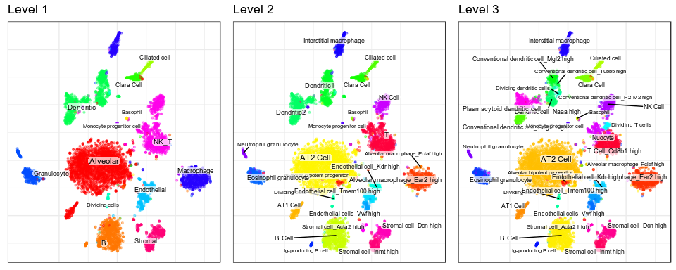
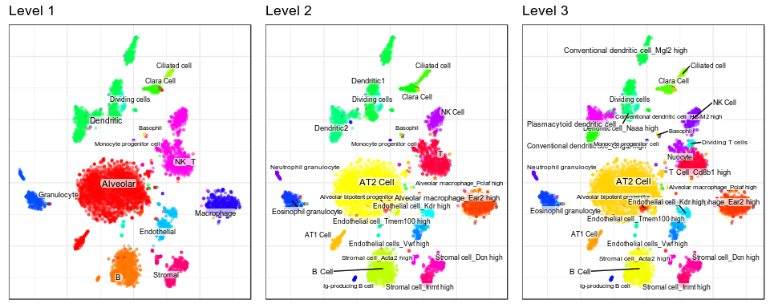
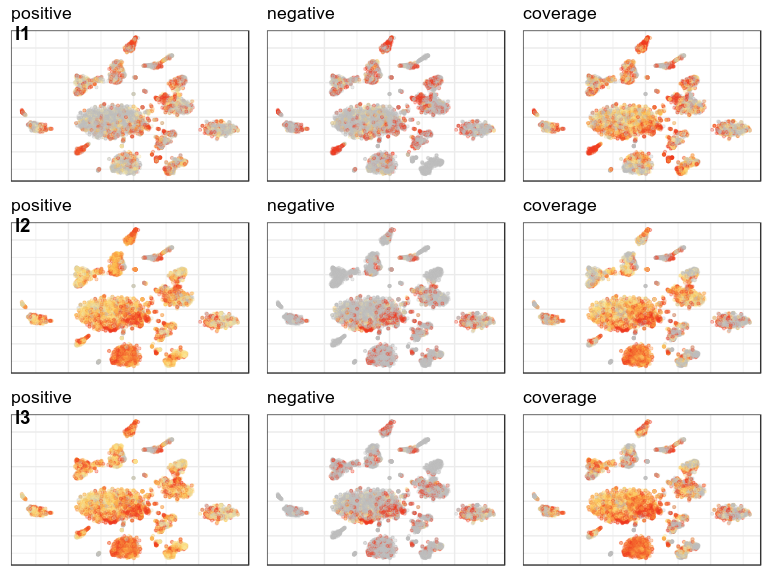
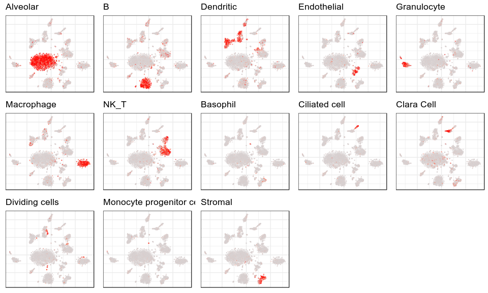
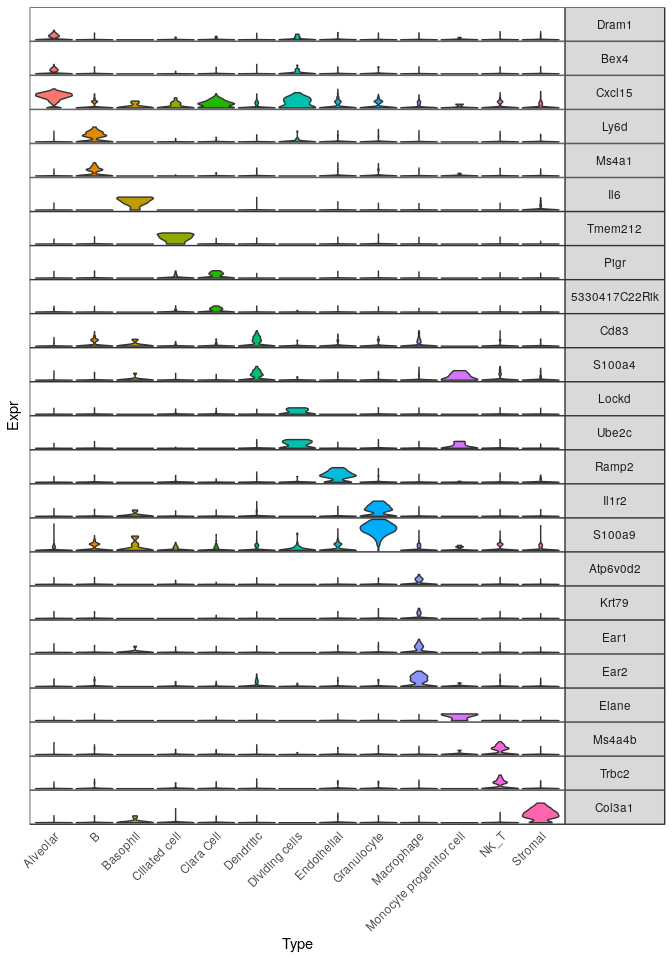

Conos alignment of new datasets
================
22 November, 2019

``` r
library(ggplot2)
library(magrittr)
library(Matrix)
library(pbapply)
library(dplyr)
library(pagoda2)
library(CellAnnotatoR)

theme_set(theme_bw())
```

## Download data

To run this vignette you need
[MCA](https://www.ncbi.nlm.nih.gov/geo/query/acc.cgi?acc=GSE108097) Lung
data, which is available under accession numbers
[GSM2906429](https://www.ncbi.nlm.nih.gov/geo/query/acc.cgi?acc=GSM2906429),
[GSM2906430](https://www.ncbi.nlm.nih.gov/geo/query/acc.cgi?acc=GSM2906430)
and
[GSM2906431](https://www.ncbi.nlm.nih.gov/geo/query/acc.cgi?acc=GSM2906431).
There, you need to download files *GSM2906429\_Lung1\_dge.txt.gz*,
*GSM2906430\_Lung2\_dge.txt.gz* and
    *GSM2906431\_Lung3\_dge.txt.gz*.

    wget https://www.ncbi.nlm.nih.gov/geo/download/\?acc\=GSM2906429\&format\=file\&file\=GSM2906429%5FLung1%5Fdge%2Etxt%2Egz -O ./GSM2906429_Lung1_dge.txt.gz
    wget https://www.ncbi.nlm.nih.gov/geo/download/\?acc\=GSM2906430\&format\=file\&file\=GSM2906430%5FLung2%5Fdge%2Etxt%2Egz -O ./GSM2906430_Lung2_dge.txt.gz
    wget https://www.ncbi.nlm.nih.gov/geo/download/\?acc\=GSM2906431\&format\=file\&file\=GSM2906431%5FLung3%5Fdge%2Etxt%2Egz -O ./GSM2906431_Lung3_dge.txt.gz

You also need to download `MCA_CellAssignments.csv` from the [paper
figshare](https://figshare.com/s/865e694ad06d5857db4b):

    wget https://ndownloader.figshare.com/files/11083451\?private_link\=865e694ad06d5857db4b -O MCA_CellAssignments.csv

Then, extract the content with `gunzip GSM2906429_Lung1_dge.txt.gz
GSM2906430_Lung2_dge.txt.gz GSM2906431_Lung3_dge.txt.gz`.

## Load data

Here, function `dataPath` contains path to the downloaded files with
data. You need to adjust it to your folder:

``` r
dataPath <- function(...) file.path("~/mh/Data/MCA/lung/", ...)

readTxtMtx <- function(path) {
  suppressWarnings(cm <- data.table::fread(path))
  cm <- as.matrix(cm[, 2:ncol(cm)], rownames=cm$V1) %>% as("dgCMatrix")
  return(cm)
}
```

``` r
cms <- list.files(dataPath(), pattern="*.txt", full.names=T) %>% lapply(readTxtMtx)

cm_merged <- conos:::mergeCountMatrices(cms)
cell_info <- read.csv(dataPath("MCA_CellAssignments.csv"))

cluster_ids <- cell_info %$% setNames(gsub("Lung_", "", ClusterID), Cell.name)
annotation <- cell_info %$% setNames(Annotation, Cell.name) %>% .[colnames(cm_merged)] %>% 
  droplevels() %>% gsub("[(]Lung[)]", "", .) %>% gsub("−", "-", .) %>% 
  setNames(colnames(cm_merged)) %>% .[!is.na(.)]
```

Here we use Pagoda2 to get embedding and differential genes. In case
your data consists of multiple datasets, Conos or Seurat may be used as
well.

``` r
p2 <- basicP2proc(cm_merged[, names(annotation)], n.cores=10, get.largevis=F, make.geneknn=F)
```

    ## 6940 cells, 23450 genes; normalizing ... using plain model winsorizing ... log scale ... done.
    ## calculating variance fit ... using gam 183 overdispersed genes ... 183persisting ... done.
    ## running PCA using 3000 OD genes .... done
    ## running tSNE using 10 cores:

``` r
conos::embeddingPlot(p2$embeddings$PCA$tSNE, groups=annotation, font.size=c(2, 3))
```

<!-- -->

## Define hierarchy

Hierarchies can be defiened either by hands or in an automated way.

### Automated inference of hierarchies

The automated algorithm is rather simple and will be improved in future.
And currently, it **can not** be used on the aligned data.

``` r
hierarchy <- deriveHierarchy(p2$reductions$PCA, annotation, max.depth=3)
clf_tree <- hierarchyToClassificationTree(hierarchy)
plotTypeHierarchy(clf_tree)
```

<!-- -->

We can give meaningful names to the most of the derived types. As Pagoda
PCA is stochastic, hierarchies may slightly vary from run to run, so
these lines must be adjusted for your
cases:

``` r
t_names <- c(l1_1="Alveolar1", l1_4="B", l1_6="Ciliated", l2_14="Endothelial1", l1_10="Endothelial",
             l2_21="Stromal1", l1_11="Stromal", l2_15="Granulocyte", l2_12="T", l1_9="T_NK", 
             l2_2="Macrophage1", l2_2="Macrophage", l2_8="Dendritic1", l2_10="Dendritic2", l1_7="Dendritic0")

igraph::V(clf_tree)[names(t_names)]$name <- t_names
```

### Manual definition of hierarchies in code

Alternatively, you can define hierarchy manually:

``` r
hierarchy <- list(
  Alveolar=c("Alveolar bipotent progenitor", "AT1 Cell", "AT2 Cell"),
  B=c("B Cell", "Ig-producing B cell"),
  Dendritic=list(Dendritic1=c("Conventional dendritic cell_Tubb5 high", "Dendritic cell_Naaa high", "Dividing dendritic cells", 
                              "Conventional dendritic cell_H2-M2 high", "Conventional dendritic cell_Mgl2 high"), 
                 Dendritic2=c("Conventional dendritic cell_Gngt2 high", "Plasmacytoid dendritic cell")),
  Endothelial=c("Endothelial cell_Kdr high", "Endothelial cell_Tmem100 high", "Endothelial cells_Vwf high"),
  Granulocyte=c("Eosinophil granulocyte", "Neutrophil granulocyte"),
  Macrophage=c("Alveolar macrophage_Ear2 high", "Alveolar macrophage_Pclaf high", "Interstitial macrophage"),
  Stromal=c("Stromal cell_Acta2 high", "Stromal cell_Dcn high", "Stromal cell_Inmt high"),
  NK_T=list(`T`=c("Dividing T cells", "T Cell_Cd8b1 high", "Nuocyte"), "NK Cell")
) %>% c(setdiff(unique(as.character(annotation)), unlist(.)))

clf_tree <- hierarchyToClassificationTree(hierarchy)
plotTypeHierarchy(clf_tree)
```

<!-- -->

## Marker selection

Original annotation by level:

``` r
ann_by_level <- mergeAnnotationByLevels(annotation, clf_tree)
plotAnnotationByLevels(p2$embeddings$PCA$tSNE, ann_by_level, font.size=c(2, 3), n.col=3, shuffle.colors=T)
```

<!-- -->

First, we need to find DE genes for each sub-brunch of the hierarchy:

``` r
ann_by_parent <- getAnnotationPerParent(clf_tree, annotation)

de_info_per_parent <- ann_by_parent %>% 
  pblapply(function(ann) p2$getDifferentialGenes(groups=ann, z.threshold=0))
```

    ## Warning in p2$getDifferentialGenes(groups = ann, z.threshold = 0): cluster
    ## vector doesn't specify groups for all of the cells, dropping missing cells
    ## from comparison
    
    ## Warning in p2$getDifferentialGenes(groups = ann, z.threshold = 0): cluster
    ## vector doesn't specify groups for all of the cells, dropping missing cells
    ## from comparison
    
    ## Warning in p2$getDifferentialGenes(groups = ann, z.threshold = 0): cluster
    ## vector doesn't specify groups for all of the cells, dropping missing cells
    ## from comparison
    
    ## Warning in p2$getDifferentialGenes(groups = ann, z.threshold = 0): cluster
    ## vector doesn't specify groups for all of the cells, dropping missing cells
    ## from comparison
    
    ## Warning in p2$getDifferentialGenes(groups = ann, z.threshold = 0): cluster
    ## vector doesn't specify groups for all of the cells, dropping missing cells
    ## from comparison
    
    ## Warning in p2$getDifferentialGenes(groups = ann, z.threshold = 0): cluster
    ## vector doesn't specify groups for all of the cells, dropping missing cells
    ## from comparison
    
    ## Warning in p2$getDifferentialGenes(groups = ann, z.threshold = 0): cluster
    ## vector doesn't specify groups for all of the cells, dropping missing cells
    ## from comparison
    
    ## Warning in p2$getDifferentialGenes(groups = ann, z.threshold = 0): cluster
    ## vector doesn't specify groups for all of the cells, dropping missing cells
    ## from comparison
    
    ## Warning in p2$getDifferentialGenes(groups = ann, z.threshold = 0): cluster
    ## vector doesn't specify groups for all of the cells, dropping missing cells
    ## from comparison
    
    ## Warning in p2$getDifferentialGenes(groups = ann, z.threshold = 0): cluster
    ## vector doesn't specify groups for all of the cells, dropping missing cells
    ## from comparison
    
    ## Warning in p2$getDifferentialGenes(groups = ann, z.threshold = 0): cluster
    ## vector doesn't specify groups for all of the cells, dropping missing cells
    ## from comparison

``` r
de_info_per_parent <- pbmapply(function(de, ann) prepareDeInfo(de, ann, cm.raw=p2$misc$rawCounts, n.cores=10), 
                               de_info_per_parent, ann_by_parent)
```

Next, do TF-IDF normalization of the
matrix:

``` r
cm_norm <- cm_merged %>% normalizeTfIdfWithFeatures() %>% .[names(annotation), ]
```

Now we can define blacklist of the genes, which shouldn’t be used as
markers:

``` r
marker_blacklist <- rownames(cm_merged) %>% .[grep("mt-", .)]
```

Finally, we run marker selection for each of the
sub-branches:

``` r
marker_info <- names(de_info_per_parent) %>% setNames(., .) %>% lapply(function(n)
  selectMarkersPerType(cm_norm, ann_by_parent[[n]], 
                       preSelectMarkerCandidates(de_info_per_parent[[n]], blacklist=marker_blacklist), 
                       parent=n, max.iters=50, max.uncertainty=0.25, log.step=5, verbose=1, n.cores=10))
```

    ## Running marker selection for parent type 'Alveolar'

    ## Refine markers...

    ## Running marker selection for parent type 'B'

    ## Refine markers...

    ## Running marker selection for parent type 'Dendritic'

    ## Refine markers...

    ## Running marker selection for parent type 'Dendritic1'

    ## Iteration 5. Max uncertainty: 0.448, mean uncertainty: 0.3. Target type: Dendritic cell_Naaa high, gene: Ppt1

    ## Iteration 10. Max uncertainty: 0.39, mean uncertainty: 0.272. Target type: Dividing dendritic cells, gene: Ptma

    ## Refine markers...

    ## Iteration 15. Max uncertainty: 0.311, mean uncertainty: 0.251. Target type: Dividing dendritic cells, gene: Cenpa

    ## Iteration 20. Max uncertainty: 0.311, mean uncertainty: 0.251. Target type: Conventional dendritic cell_Tubb5 high, gene: Racgap1

    ## Refine markers...

    ## Iteration 25. Max uncertainty: 0.296, mean uncertainty: 0.237. Target type: Dividing dendritic cells, gene: Pclaf

    ## Iteration 30. Max uncertainty: 0.314, mean uncertainty: 0.227. Target type: Conventional dendritic cell_Tubb5 high, gene: Lgals1

    ## Refine markers...

    ## Iteration 35. Max uncertainty: 0.314, mean uncertainty: 0.227. Target type: Conventional dendritic cell_Tubb5 high, gene: Ran

    ## Iteration 40. Max uncertainty: 0.314, mean uncertainty: 0.227. Target type: Conventional dendritic cell_Tubb5 high, gene: Arl6ip1

    ## Iteration 45. Max uncertainty: 0.314, mean uncertainty: 0.227. Target type: Conventional dendritic cell_Tubb5 high, gene: Ppia

    ## Iteration 50. Max uncertainty: 0.332, mean uncertainty: 0.21. Target type: Dividing dendritic cells, gene: Arl6ip1

    ## Refine markers...

    ## Running marker selection for parent type 'Dendritic2'

    ## Refine markers...

    ## Running marker selection for parent type 'Endothelial'

    ## Iteration 5. Max uncertainty: 0.225, mean uncertainty: 0.203. Target type: Endothelial cell_Tmem100 high, gene: Plvap

    ## Refine markers...

    ## Running marker selection for parent type 'Granulocyte'

    ## Refine markers...

    ## Running marker selection for parent type 'Macrophage'

    ## Iteration 5. Max uncertainty: 0.291, mean uncertainty: 0.209. Target type: Alveolar macrophage_Ear2 high, gene: Map1lc3b

    ## Refine markers...

    ## Running marker selection for parent type 'NK_T'

    ## Refine markers...

    ## Running marker selection for parent type 'root'

    ## Iteration 5. Max uncertainty: 0.932, mean uncertainty: 0.722. Target type: Clara Cell, gene: 5330417C22Rik

    ## Iteration 10. Max uncertainty: 0.935, mean uncertainty: 0.516. Target type: Granulocyte, gene: Clec4d

    ## Refine markers...

    ## Iteration 15. Max uncertainty: 0.573, mean uncertainty: 0.38. Target type: Macrophage, gene: Ear2

    ## Iteration 20. Max uncertainty: 0.532, mean uncertainty: 0.349. Target type: Alveolar, gene: Cxcl15

    ## Refine markers...

    ## Iteration 25. Max uncertainty: 0.499, mean uncertainty: 0.336. Target type: Dividing cells, gene: Stmn1

    ## Iteration 30. Max uncertainty: 0.476, mean uncertainty: 0.329. Target type: Monocyte progenitor cell, gene: Ly6c2

    ## Refine markers...

    ## Iteration 35. Max uncertainty: 0.476, mean uncertainty: 0.329. Target type: Monocyte progenitor cell, gene: Psap

    ## Iteration 40. Max uncertainty: 0.476, mean uncertainty: 0.329. Target type: Monocyte progenitor cell, gene: Prdx5

    ## Iteration 45. Max uncertainty: 0.476, mean uncertainty: 0.329. Target type: Monocyte progenitor cell, gene: Capzb

    ## Iteration 50. Max uncertainty: 0.476, mean uncertainty: 0.329. Target type: Monocyte progenitor cell, gene: S100a4

    ## Running marker selection for parent type 'Stromal'

    ## Refine markers...

    ## Running marker selection for parent type 'T'

    ## Warning in preSelectMarkerCandidates(de_info_per_parent[[n]], blacklist =
    ## marker_blacklist): Some cell types don't have positive or negative markers

    ## Iteration 5. Max uncertainty: 0.314, mean uncertainty: 0.244. Target type: Nuocyte, gene: Icos

    ## Refine markers...

``` r
marker_list <- setNames(marker_info, NULL) %>% unlist(recursive=F)
```

## Improving known list of markers

If you already know some markers, this knowledge can be used. You can
either read the markers from file or create marker list by hands in
code.

Reading markers:

``` r
marker_list_prior <- parseMarkerFile("markers_prior.txt")
```

Create by hands:

``` r
marker_list_prior <- emptyMarkerList(clf.tree=clf_tree)
marker_list_prior$`Conventional dendritic cell_Mgl2 high`$expressed <- c("Mgl2")
marker_list_prior$`Dendritic cell_Naaa high`$expressed <- c("Naaa")
```

Check, which markers aren’t presented in the
matrix:

``` r
lapply(marker_list_prior, `[`, c("expressed", "not_expressed")) %>% unlist() %>% 
  setdiff(colnames(cm_norm))
```

    ## character(0)

``` r
marker_info <- names(de_info_per_parent) %>% setNames(., .) %>% lapply(function(n)
  selectMarkersPerType(cm_norm, ann_by_parent[[n]], 
                       preSelectMarkerCandidates(de_info_per_parent[[n]], blacklist=marker_blacklist), 
                       marker.list=marker_list_prior,
                       parent=n,max.iters=50, max.uncertainty=0.25, log.step=5, verbose=1, n.cores=10))
```

    ## Running marker selection for parent type 'Alveolar'

    ## Refine markers...

    ## Running marker selection for parent type 'B'

    ## Refine markers...

    ## Running marker selection for parent type 'Dendritic'

    ## Refine markers...

    ## Running marker selection for parent type 'Dendritic1'

    ## Iteration 5. Max uncertainty: 0.651, mean uncertainty: 0.356. Target type: Dividing dendritic cells, gene: Ptma

    ## Iteration 10. Max uncertainty: 0.364, mean uncertainty: 0.27. Target type: Dividing dendritic cells, gene: Cenpa

    ## Refine markers...

    ## Iteration 15. Max uncertainty: 0.316, mean uncertainty: 0.258. Target type: Dividing dendritic cells, gene: Ube2c

    ## Refine markers...

    ## Running marker selection for parent type 'Dendritic2'

    ## Refine markers...

    ## Running marker selection for parent type 'Endothelial'

    ## Iteration 5. Max uncertainty: 0.225, mean uncertainty: 0.203. Target type: Endothelial cell_Tmem100 high, gene: Plvap

    ## Refine markers...

    ## Running marker selection for parent type 'Granulocyte'

    ## Refine markers...

    ## Running marker selection for parent type 'Macrophage'

    ## Iteration 5. Max uncertainty: 0.291, mean uncertainty: 0.209. Target type: Alveolar macrophage_Ear2 high, gene: Map1lc3b

    ## Refine markers...

    ## Running marker selection for parent type 'NK_T'

    ## Refine markers...

    ## Running marker selection for parent type 'root'

    ## Iteration 5. Max uncertainty: 0.932, mean uncertainty: 0.722. Target type: Clara Cell, gene: 5330417C22Rik

    ## Iteration 10. Max uncertainty: 0.935, mean uncertainty: 0.516. Target type: Granulocyte, gene: Clec4d

    ## Refine markers...

    ## Iteration 15. Max uncertainty: 0.573, mean uncertainty: 0.38. Target type: Macrophage, gene: Ear2

    ## Iteration 20. Max uncertainty: 0.532, mean uncertainty: 0.349. Target type: Alveolar, gene: Cxcl15

    ## Refine markers...

    ## Iteration 25. Max uncertainty: 0.499, mean uncertainty: 0.337. Target type: Dividing cells, gene: Stmn1

    ## Iteration 30. Max uncertainty: 0.476, mean uncertainty: 0.33. Target type: Monocyte progenitor cell, gene: Ly6c2

    ## Refine markers...

    ## Iteration 35. Max uncertainty: 0.476, mean uncertainty: 0.33. Target type: Monocyte progenitor cell, gene: Psap

    ## Iteration 40. Max uncertainty: 0.476, mean uncertainty: 0.33. Target type: Monocyte progenitor cell, gene: Prdx5

    ## Iteration 45. Max uncertainty: 0.476, mean uncertainty: 0.33. Target type: Monocyte progenitor cell, gene: Capzb

    ## Iteration 50. Max uncertainty: 0.476, mean uncertainty: 0.33. Target type: Monocyte progenitor cell, gene: S100a4

    ## Running marker selection for parent type 'Stromal'

    ## Refine markers...

    ## Running marker selection for parent type 'T'

    ## Warning in preSelectMarkerCandidates(de_info_per_parent[[n]], blacklist =
    ## marker_blacklist): Some cell types don't have positive or negative markers

    ## Iteration 5. Max uncertainty: 0.314, mean uncertainty: 0.244. Target type: Nuocyte, gene: Icos

    ## Refine markers...

``` r
marker_list <- setNames(marker_info, NULL) %>% unlist(recursive=F)
```

## Diagnostics

Number of markers per type:

``` r
sapply(marker_list, sapply, length)[1:2,] %>% t()
```

    ##                                        expressed not_expressed
    ## Alveolar bipotent progenitor                   1             2
    ## AT1 Cell                                       1             0
    ## AT2 Cell                                       1             2
    ## B Cell                                         1             2
    ## Ig-producing B cell                            1             0
    ## Dendritic1                                     1             1
    ## Dendritic2                                     1             0
    ## Conventional dendritic cell_H2-M2 high         1             0
    ## Conventional dendritic cell_Mgl2 high          2             2
    ## Conventional dendritic cell_Tubb5 high         6             5
    ## Dendritic cell_Naaa high                       3             4
    ## Dividing dendritic cells                       5             5
    ## Conventional dendritic cell_Gngt2 high         2             4
    ## Plasmacytoid dendritic cell                    1             1
    ## Endothelial cell_Kdr high                      1             2
    ## Endothelial cell_Tmem100 high                  3             4
    ## Endothelial cells_Vwf high                     1             0
    ## Eosinophil granulocyte                         1             1
    ## Neutrophil granulocyte                         1             0
    ## Alveolar macrophage_Ear2 high                  4             6
    ## Alveolar macrophage_Pclaf high                 2             1
    ## Interstitial macrophage                        1             0
    ## NK Cell                                        1             0
    ## T                                              1             1
    ## Alveolar                                       2             4
    ## B                                              2             2
    ## Basophil                                       1             0
    ## Ciliated cell                                  1             0
    ## Clara Cell                                     2             3
    ## Dendritic                                      2             4
    ## Dividing cells                                 2             1
    ## Endothelial                                    1             2
    ## Granulocyte                                    1             2
    ## Macrophage                                     2             2
    ## Monocyte progenitor cell                       2             1
    ## NK_T                                           2             4
    ## Stromal                                        1             0
    ## Stromal cell_Acta2 high                        1             1
    ## Stromal cell_Dcn high                          2             2
    ## Stromal cell_Inmt high                         1             2
    ## Dividing T cells                               1             0
    ## Nuocyte                                        3             4
    ## T Cell_Cd8b1 high                              2             4

To evaluate quality of these markers we can annotate cell using them and
use the uncertainty plots.

``` r
clf_data <- getClassificationData(cm_norm, marker_list, prenormalized=T)
ann_info <- assignCellsByScores(NULL, clf_data, clusters=annotation)
```

Original
annotation:

``` r
plotAnnotationByLevels(p2$embeddings$PCA$tSNE, ann_by_level, n.col=3, font.size=c(2, 3))
```

<!-- -->

New
annotation:

``` r
plotAnnotationByLevels(p2$embeddings$PCA$tSNE, ann_info$annotation, n.col=3, font.size=c(2, 3))
```

<!-- -->

Uncertainty plots per cell:

``` r
score_info <- getMarkerScoreInfo(clf_data)
unc_per_cell <- scoreCellUncertaintyPerLevel(ann_info, score_info)

lapply(unc_per_cell, function(unc) plotUncertaintyPerCell(p2$embeddings$PCA$tSNE, unc)) %>% 
  cowplot::plot_grid(plotlist=., ncol=1, labels=names(unc_per_cell), label_y=0.9, label_x=0.01)
```

<!-- -->

Level 1 assignment scores shown on cell
embedding:

``` r
plotAssignmentScores(p2$embeddings$PCA$tSNE, ann_info$scores$l1, clf_data$classification.tree, parent="root", build.panel=T, size=0.1, n.col=5)
```

<!-- -->

Positive
markers:

``` r
marker_list[sort(unique(ann_by_level$l1))] %>% lapply(`[[`, "expressed") %>% 
  unlist() %>% unique() %>% 
  plotExpressionViolinMap(p2$counts, ann_by_level$l1, gene.order=T)
```

<!-- -->

## Save to a file

``` r
markerListToMarkup(marker_list, file="mca_markers_auto.txt")
```

    ## [1] "mca_markers_auto.txt"
