Annotation QC on Mouse Cell Atlas Lung dataset
================
25 November, 2019

``` r
library(ggplot2)
library(magrittr)
library(Matrix)
library(pbapply)
library(dplyr)
library(pagoda2)
library(CellAnnotatoR)

theme_set(theme_bw())
```

## Download data

This vignette uses the same data as “mca\_marker\_selection.Rmd”. Please
check it to download the data.

## Load data

Here, function `dataPath` contains path to the downloaded files with
data. You need to adjust it to your folder:

``` r
marker_path <- "../markers/mca_lung.md"
dataPath <- function(...) file.path("~/mh/Data/MCA/lung/", ...)

readTxtMtx <- function(path) {
  suppressWarnings(cm <- data.table::fread(path))
  cm <- as.matrix(cm[, 2:ncol(cm)], rownames=cm$V1) %>% as("dgCMatrix")
  return(cm)
}
```

``` r
cms <- list.files(dataPath(), pattern="*.txt", full.names=T) %>% lapply(readTxtMtx)

cm_merged <- conos:::mergeCountMatrices(cms)
cell_info <- read.csv(dataPath("MCA_CellAssignments.csv"))

cluster_ids <- cell_info %$% setNames(gsub("Lung_", "", ClusterID), Cell.name)
annotation <- cell_info %$% setNames(Annotation, Cell.name) %>% .[colnames(cm_merged)] %>% 
  droplevels() %>% gsub("[(]Lung[)]", "", .) %>% gsub("−", "-", .) %>% 
  setNames(colnames(cm_merged)) %>% .[!is.na(.)]
```

We simplify annotation a bit for the demonstration purpose:

``` r
annotation_map <- c(
  `AT2 Cell`="AT2",
  `AT1 Cell`="AT1",
  `Alveolar bipotent progenitor`="AT2",
  `Ig−producing B cell`="B cells",
  `B Cell`="B cells",
  `Ciliated cell`="Ciliated cells",
  `Clara Cell`="Ciliated cells",
  `Dividing cells`="Ciliated cells",
  `Endothelial cell_Tmem100 high`="Endothelial",
  `Endothelial cells_Vwf high`="Endothelial",
  `Endothelial cell_Kdr high`="Endothelial",
  `Stromal cell_Inmt high`="Fibroblasts",
  `Stromal cell_Dcn high`="Fibroblasts",
  `Stromal cell_Acta2 high`="Fibroblasts",
  `Neutrophil granulocyte`="Granulocytes",
  `Eosinophil granulocyte`="Granulocytes",
  `Conventional dendritic cell_H2-M2 high`="H2-M2 DCs",
  `Dendritic cell_Naaa high`="Naaa DCs",
  `Dividing dendritic cells`="Naaa DCs",
  `Conventional dendritic cell_Tubb5 high`="Mgl2 DCs",
  `Conventional dendritic cell_Gngt2 high`="Plasmacytoid DCs",
  `Plasmacytoid dendritic cell`="Plasmacytoid DCs",
  `Conventional dendritic cell_Mgl2 high`="Mgl2 DCs",
  `Alveolar macrophage_Ear2 high`="Alveolar macrophage",
  `Alveolar macrophage_Pclaf high`="Alveolar macrophage",
  `NK Cell`="Natural killer cells",
  `T Cell_Cd8b1 high`="T cells",
  `Dividing T cells`="T cells",
  `Nuocyte`="T cells"
)

annotation[annotation %in% names(annotation_map)] <-  annotation_map[annotation[annotation %in% names(annotation_map)]]
```

``` r
p2 <- basicP2proc(cm_merged[, names(annotation)], n.cores=10, get.largevis=F, make.geneknn=F)
```

    ## 6940 cells, 23450 genes; normalizing ... using plain model winsorizing ... log scale ... done.
    ## calculating variance fit ... using gam 183 overdispersed genes ... 183persisting ... done.
    ## running PCA using 3000 OD genes .... done
    ## running tSNE using 10 cores:

``` r
p2$getKnnClusters(type="PCA", method=conos::leiden.community, resolution=6, n.iterations=10, name="leiden")
```

Original annotation:

``` r
cowplot::plot_grid(
  conos::embeddingPlot(p2$embeddings$PCA$tSNE, groups=annotation, font.size=c(3, 5)),
  conos::embeddingPlot(p2$embeddings$PCA$tSNE, groups=p2$clusters$PCA$leiden, font.size=c(3, 5)),
  nrow=1
)
```

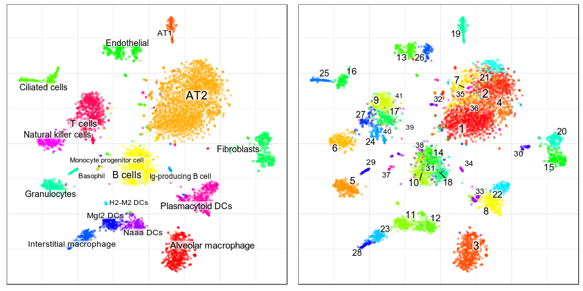<!-- -->

## Annotation

``` r
cm_norm <- Matrix::t(p2$misc$rawCounts) %>% normalizeTfIdfWithFeatures()
marker_list <- parseMarkerFile(marker_path)
```

Let’s do some distortion of markers to introduce problems to the
annotation:

``` r
marker_list$AT1 <- NULL # Remove whole subtype
marker_list$AT2$expressed %<>% setdiff("Sfta2") # Remove one of the positive markers
marker_list$`Interstitial macrophage`$not_expressed %<>% c("Mgl2") # Wrong negative marker
```

And run classification:

``` r
clf_data <- getClassificationData(cm_norm, marker_list, prenormalized=T)
ann_by_level <- assignCellsByScores(p2$graphs$PCA, clf_data, clusters=p2$clusters$PCA$leiden)
```

Results contain to types of annotation:

  - `annotation` has all cells assigned by maximal likelihood
  - `annotation.filt` has kind of the same data, but cells, which didn’t
    pass QC are set to `NA`

It’s usefult to plot
both:

``` r
plotAnnotationByLevels(p2$embeddings$PCA$tSNE, ann_by_level$annotation, size=0.2, 
                       font.size=c(2, 4), shuffle.colors=T)
```

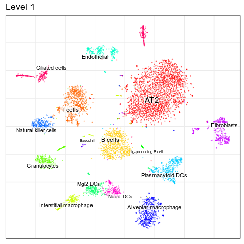<!-- -->

``` r
plotAnnotationByLevels(p2$embeddings$PCA$tSNE, ann_by_level$annotation.filt, size=0.2, 
                       font.size=c(2, 4), shuffle.colors=T)
```

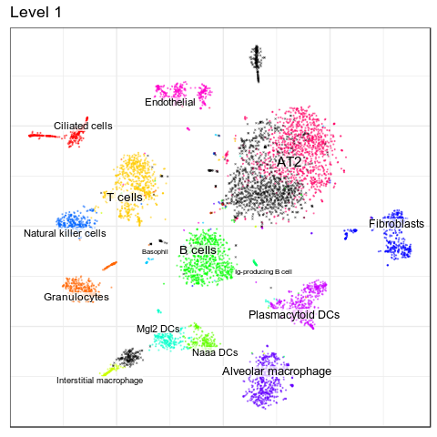<!-- -->

So we see that though most cell types (with exception of AT1) are
classified correctly, annotation for some of them should be improved. To
understand the reason we need to perform QC.

## Three types of uncertainty

There are three types of uncertainty we can distinguish:

1.  Low coverage with positive markers
2.  High expression of negative markers for all types
3.  Conflicting positive markers

Either of these problems is enough to missclassify a cell. So we can
plot these metric per cell:

``` r
score_info <- getMarkerScoreInfo(clf_data)
unc_info <- scoreCellUncertaintyPerLevel(ann_by_level, score_info)
plotUncertaintyPerCell(p2$embeddings$PCA$tSNE, unc_info$l1, size=0.3)
```

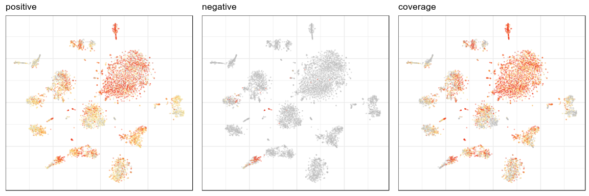<!-- -->

Or per
cluster:

``` r
unc_per_clust <- scoreClusterUncertaintyPerLevel(unc_info, p2$clusters$PCA$leiden)
plotUncertaintyPerClust(unc_per_clust$l1, p2$clusters$PCA$leiden, annotation=ann_by_level$annotation$l1)
```

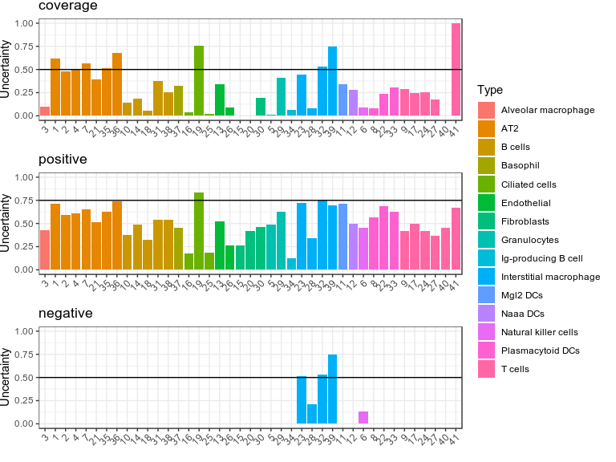<!-- -->

Indeed, we can do it per cell
type:

``` r
unc_per_clust <- scoreClusterUncertaintyPerLevel(unc_info, ann_by_level$annotation$l1)
plotUncertaintyPerClust(unc_per_clust$l1, ann_by_level$annotation$l1, n.col=3, text.angle=60)
```

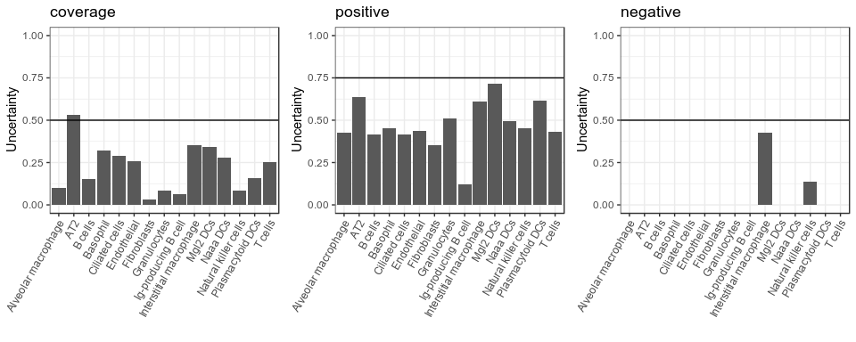<!-- -->

## More detailed QC

To get a bit more information about problem of conflicting positive
markers we can plot assignment confusion
heatmap:

``` r
plotAssignmentConfusion(ann_by_level$scores$l1, annotation=ann_by_level$annotation$l1)
```

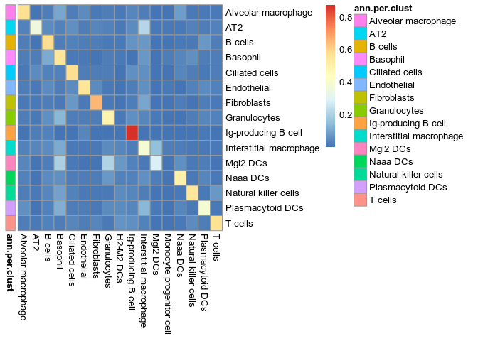<!-- -->

Or, to get more information, we can go it per
cluster:

``` r
plotAssignmentConfusion(ann_by_level$scores$l1, annotation=ann_by_level$annotation$l1, clusters=p2$clusters$PCA$leiden)
```

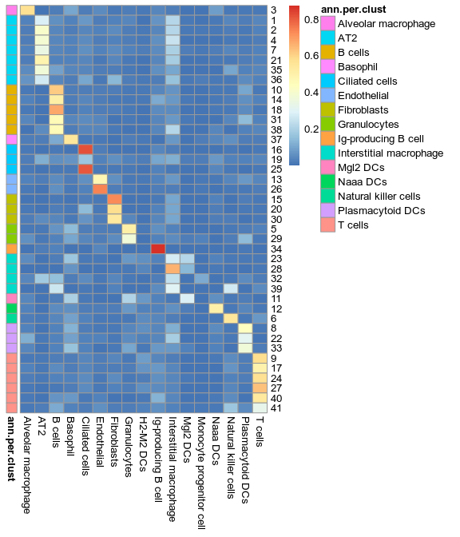<!-- -->

Here we can see several important facts:

1.  Monocyte progenitor cells are completely missed, and there is even
    no single cluster corresponding to them
2.  Interstitial macrophages conflicts with AT2 cells
3.  Granulocytes and basophils conflicts with Mgl2 DCs

Even more verbose version of this heatmap is plotting assignment score
per
cell:

``` r
plotAssignmentScores(p2$embeddings$PCA$tSNE, ann_by_level$scores$l1, clf_data$classification.tree, size=0.1)
```

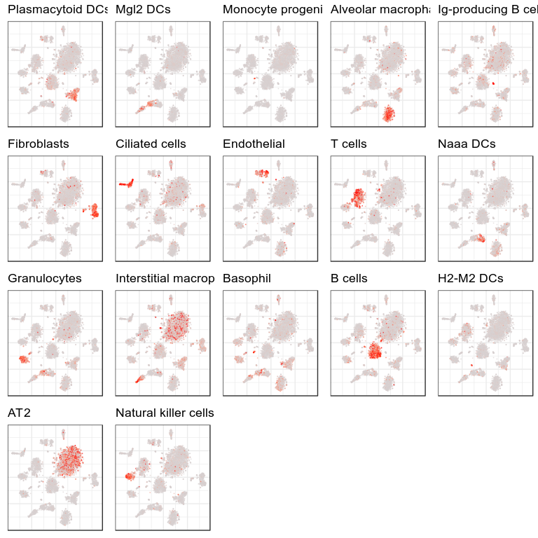<!-- -->

On this plot we can see that type “Monocyte progenitor cells” indeed
label proper cells, but they’re not assigned properly because clustering
resolution is too low.

Finally, the most comprehensive representation of the markers is
plotting expression of the each marker. It also can be done per cell
type, per cluster or per cell.

Per cell
type:

``` r
plotMarkerListViolinMap(p2$counts, annotation=ann_by_level$annotation$l1, text.angle=60, 
                        gene.order=T, marker.list=clf_data$marker.list)
```

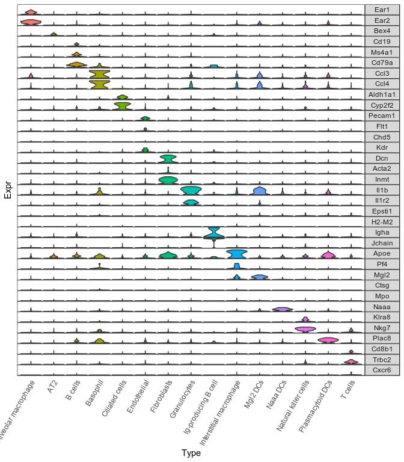<!-- -->

*To plot arbitrary set of markers, check `plotExpressionViolinMap`
function*

Markers per
cell:

``` r
plotSubtypeMarkers(p2$embeddings$PCA$tSNE, p2$counts, marker.list=clf_data$marker.list, size=0.2, 
                   font.size=c(2, 4), shuffle.colors=T, build.panel=T, n.col=4)
```

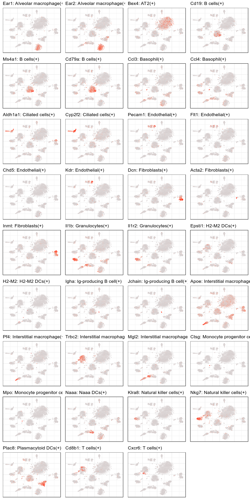<!-- -->

*To plot arbitrary set of markers, check `plotGeneExpression` function*

## Fixing QC problems

Now it’s time to combine all obtained knowledge and to improve quality
of annotation. Here we’ll be adding markers by modifying `marker.list`,
but normally you should change the markup file and reload it to get the
new marker list.

First of all, let’s increase clustering
resolution:

``` r
p2$getKnnClusters(type="PCA", method=conos::leiden.community, resolution=10, n.iterations=10, name="leiden")

cowplot::plot_grid(
  conos::embeddingPlot(p2$embeddings$PCA$tSNE, groups=annotation, font.size=c(3, 5)),
  conos::embeddingPlot(p2$embeddings$PCA$tSNE, groups=p2$clusters$PCA$leiden, font.size=c(3, 5)),
  nrow=1
)
```

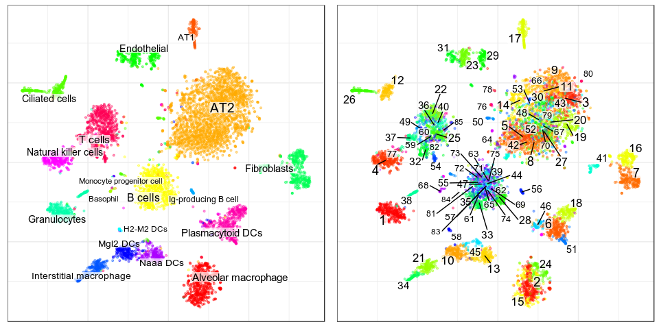<!-- -->

Now we need to add some more positive markers for AT2 cluster.
Fortunately, there are plenty in the paper (see [Fig.
S4B](https://www.cell.com/cell/fulltext/S0092-8674\(18\)30116-8#figs4))

``` r
c("Wfdc2", "Sfta2", "Sftpb", "Sftpc", "Bex4", "Sftpd", "Sftpa1") %>% 
  plotGeneExpression(p2$embeddings$PCA$tSNE, p2$counts, size=0.1)
```

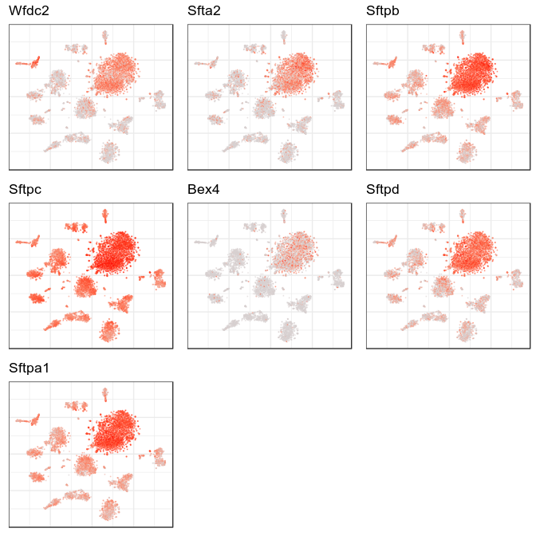<!-- -->

And here only Bex4 was used:

``` r
clf_data$marker.list$AT2
```

    ## $expressed
    ## [1] "Bex4"
    ## 
    ## $not_expressed
    ## character(0)
    ## 
    ## $parent
    ## character(0)

So, let’s add Sfta2 and Wfdc2. Though, as Wfdc2 also covers Ciliated
cells we need to add some negative markers to discriminate them:

``` r
clf_data$marker.list$`Ciliated cells`$expressed %>% 
  plotGeneExpression(p2$embeddings$PCA$tSNE, p2$counts, size=0.1)
```

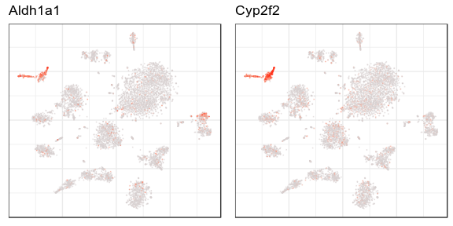<!-- -->

``` r
clf_data$marker.list$AT2$expressed %<>% union(c("Sfta2", "Wfdc2"))
clf_data$marker.list$AT2$not_expressed %<>% union(clf_data$marker.list$`Ciliated cells`$expressed)
```

We also know that Interstitial macrophage markers are expressed in AT2
cluster. Let’s add negative marker there as
well:

``` r
clf_data$marker.list$`Interstitial macrophage`$not_expressed %<>% union("Sfta2")
```

Finally, we remember that Interstitial macrophages had high uncertainty
by negative markers. Let’s plot their markers and check:

``` r
clf_data$marker.list$`Interstitial macrophage`$not_expressed %>% 
  plotGeneExpression(p2$embeddings$PCA$tSNE, p2$counts, size=0.1, n.col=3)
```

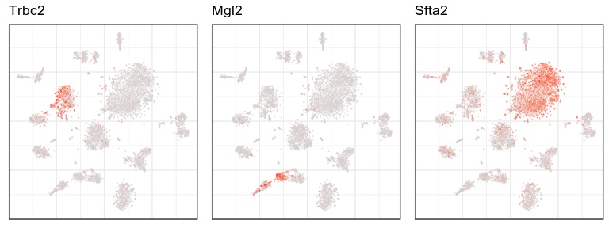<!-- -->

We can see that Mgl2 is indeed expressed in Interstitial macrophages, so
it shouldn’t be used as a negative
marker:

``` r
clf_data$marker.list$`Interstitial macrophage`$not_expressed %<>% setdiff("Mgl2")
```

Now let’s re-anntate the data with the adjusted
markers:

``` r
ann_by_level <- assignCellsByScores(p2$graphs$PCA, clf_data, clusters=p2$clusters$PCA$leiden)
```

``` r
plotAnnotationByLevels(p2$embeddings$PCA$tSNE, ann_by_level$annotation, size=0.2, 
                       font.size=c(2, 4), shuffle.colors=T)
```

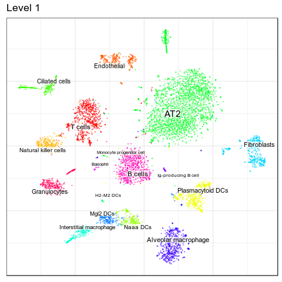<!-- -->

``` r
plotAnnotationByLevels(p2$embeddings$PCA$tSNE, ann_by_level$annotation.filt, size=0.2, 
                       font.size=c(2, 4), shuffle.colors=T)
```

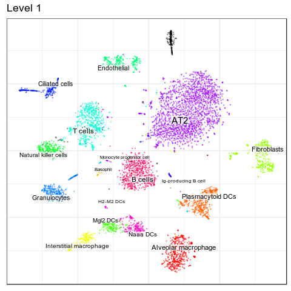<!-- -->

We still see that one cluster is not annotated. Let’s run differential
expression on these
cells:

``` r
unknown_clust <- p2$clusters$PCA$leiden %>% names() %>% split(p2$clusters$PCA$leiden) %>% 
  sapply(function(cbs) mean(is.na(ann_by_level$annotation.filt$l1[cbs]))) %>% 
  which.max() %>% names()

de_genes <- p2$getDifferentialGenes(type="PCA", clusterType="leiden", append.auc=T)[[unknown_clust]]
de_genes_f <- de_genes %>% filter(AUC > 0.75) %>% arrange(-Specificity)
head(de_genes_f)
```

    ##          Z        M highest      fe   Gene       AUC Specificity Precision
    ## 1 14.29934 5.032947    TRUE 0.69375 Igfbp2 0.8412703   0.9888710 0.5935829
    ## 2 12.45335 4.818621    TRUE 0.61250 Spock2 0.8001291   0.9878690 0.5414365
    ## 3 11.92466 4.528352    TRUE 0.59375   Pdpn 0.7879517   0.9823229 0.4398148
    ## 4 16.20443 4.589269    TRUE 0.78750   Hopx 0.8812131   0.9750514 0.4256757
    ## 5 11.64887 4.239127    TRUE 0.58750  Clic5 0.7804019   0.9735612 0.3418182
    ## 6 12.38905 4.030839    TRUE 0.62500  Pdgfa 0.7925885   0.9605263 0.2702703
    ##   ExpressionFraction
    ## 1            0.69375
    ## 2            0.61250
    ## 3            0.59375
    ## 4            0.78750
    ## 5            0.58750
    ## 6            0.62500

``` r
de_genes_f$Gene[1:5] %>% 
  plotGeneExpression(p2$embeddings$PCA$tSNE, p2$counts, size=0.1)
```

<!-- -->

Now we can query these genes using
[SCfind](https://scfind.sanger.ac.uk/) tool on [Tabula
Muris](https://scfind.sanger.ac.uk/tm-facs/) dataset. Indeed, we could
run it straight on Mouse Cell Atlas, but it would be cheating.

Using query “Igfbp2 and Spock2 and Pdpn” shows that it’s “Lung.type I
pneumocyte”. 

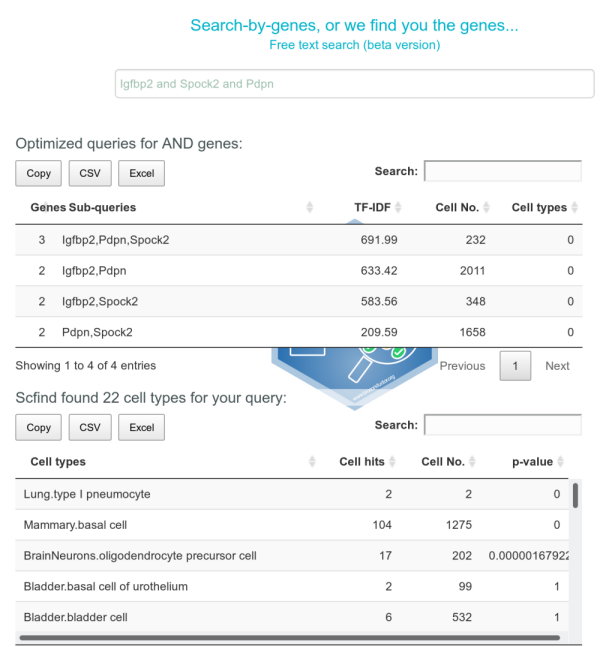

And it’s exactly Alveolar Type I, which we removed
distorting the data. So, let’s add it:

``` r
clf_data$marker.list %<>% c(emptyMarkerList("AT1", parent="root"))
clf_data$marker.list$AT1$expressed %<>% union(c("Igfbp2", "Spock2"))
clf_data$classification.tree <- createClassificationTree(clf_data$marker.list)
```

Let’s re-run annotation
again:

``` r
ann_by_level <- assignCellsByScores(p2$graphs$PCA, clf_data, clusters=p2$clusters$PCA$leiden)
```

``` r
plotAnnotationByLevels(p2$embeddings$PCA$tSNE, ann_by_level$annotation, size=0.2, 
                       font.size=c(2, 4), shuffle.colors=T)
```

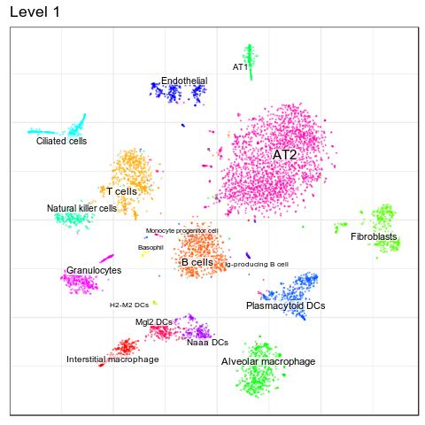<!-- -->

``` r
plotAnnotationByLevels(p2$embeddings$PCA$tSNE, ann_by_level$annotation.filt, size=0.2, 
                       font.size=c(2, 4), shuffle.colors=T)
```

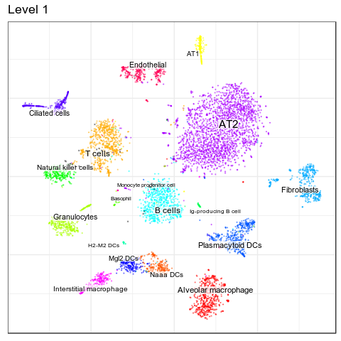<!-- -->

And now it works\! Still, it’s nice to plot uncertainty per cell to
double-check:

``` r
score_info <- getMarkerScoreInfo(clf_data)
unc_info <- scoreCellUncertaintyPerLevel(ann_by_level, score_info)
plotUncertaintyPerCell(p2$embeddings$PCA$tSNE, unc_info$l1, size=0.3)
```

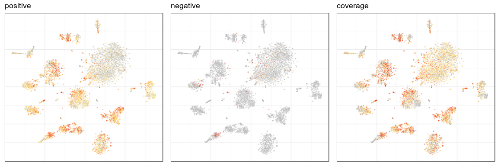<!-- -->

We see that whole marker coverage is shallow, and adding more marker
genes per type would be nice, but even this is enough for correct
annotation.
