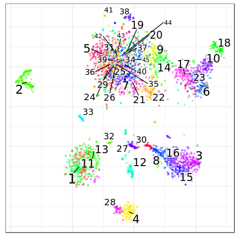
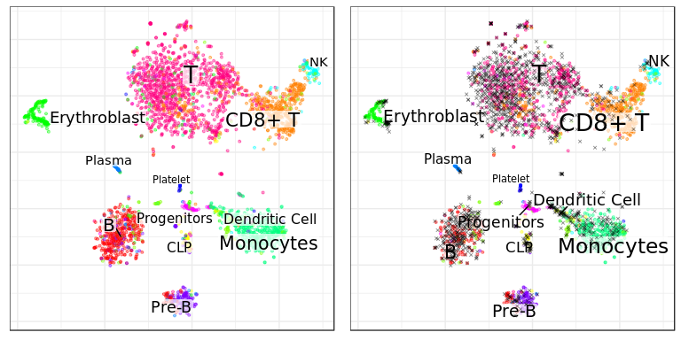
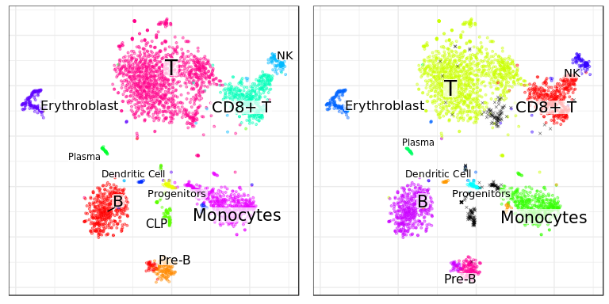
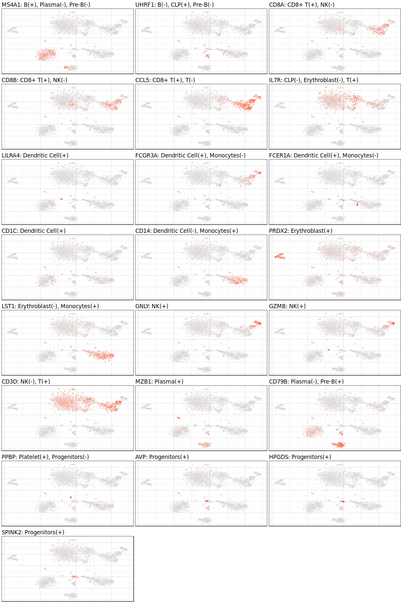

Annotation of BM data using Pagoda 2
================

This vignette shows annotation of the first BM dataset from the [Conos
tutorial](https://github.com/hms-dbmi/conos/blob/master/vignettes/walkthrough.md)

``` r
library(CellAnnotatoR)
library(pagoda2)
library(dplyr)
library(ggplot2)
library(pbapply)
library(magrittr)

theme_set(theme_bw())
```

## Pre-processing

Let’s load and pre-process
data:

``` r
cm <- system.file("extdata", "panel.rds", package="conos") %>% readRDS() %>% .[[1]]

p2 <- basicP2proc(cm, n.cores=4, min.cells.per.gene=0, n.odgenes=2e3, 
                  get.largevis=FALSE, make.geneknn=FALSE, get.tsne=T)
#> 3000 cells, 33694 genes; normalizing ... using plain model winsorizing ... log scale ... done.
#> calculating variance fit ... using gam 171 overdispersed genes ... 171persisting ... done.
#> running PCA using 2000 OD genes .... done
#> running tSNE using 4 cores:
p2$getKnnClusters(type="PCA", method=conos::leiden.community, n.iterations=10, 
                  resolution=6, name="leiden")
```

Here we use such large resulution because it will be used for the
annotation refinement: for high-resolution annotation, clustering
resolution must be high as well.

``` r
clusters <- p2$clusters$PCA$leiden
conos::embeddingPlot(p2$embeddings$PCA$tSNE, groups=clusters, shuffle.colors=T)
```

<!-- -->

Prepare data for
annotation:

``` r
marker_path <- system.file("extdata", "bm_cb.md", package = "CellAnnotatoR")
clf_data <- getClassificationData(cm, marker_path)
```

## Annotation

Now we can run annotation:

``` r
ann_by_level <- assignCellsByScores(p2$graphs$PCA, clf.data=clf_data)
cowplot::plot_grid(
  conos::embeddingPlot(p2$embeddings$PCA$tSNE, groups=ann_by_level$annotation$l1),
  conos::embeddingPlot(p2$embeddings$PCA$tSNE, groups=ann_by_level$annotation.filt$l1),
  nrow=1
)
```

<!-- -->

To improve quality we can also pass clusters to the annotation
procedure:

``` r
ann_by_level <- assignCellsByScores(p2$graphs$PCA, clf.data=clf_data, clusters=clusters)
cowplot::plot_grid(
  conos::embeddingPlot(p2$embeddings$PCA$tSNE, groups=ann_by_level$annotation$l1, shuffle.colors=T),
  conos::embeddingPlot(p2$embeddings$PCA$tSNE, groups=ann_by_level$annotation.filt$l1, shuffle.colors=T),
  nrow=1
)
```

<!-- -->

Finally, to validate results we can plot the
markers:

``` r
plotSubtypeMarkers(p2$embeddings$PCA$tSNE, p2$counts, clf.data=clf_data, n.col=3, size=0.2, build.panel=T)
```

<!-- -->
