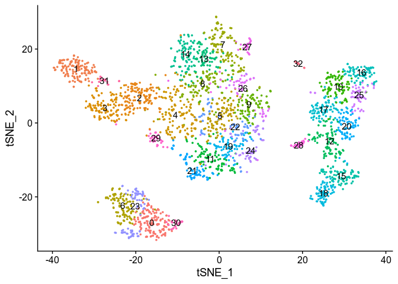
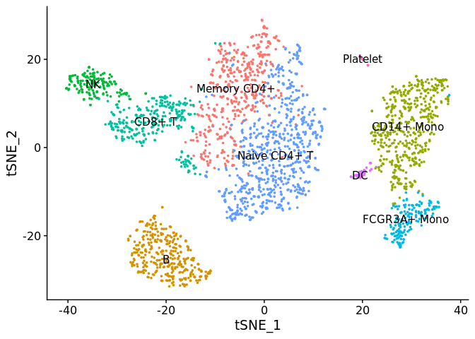
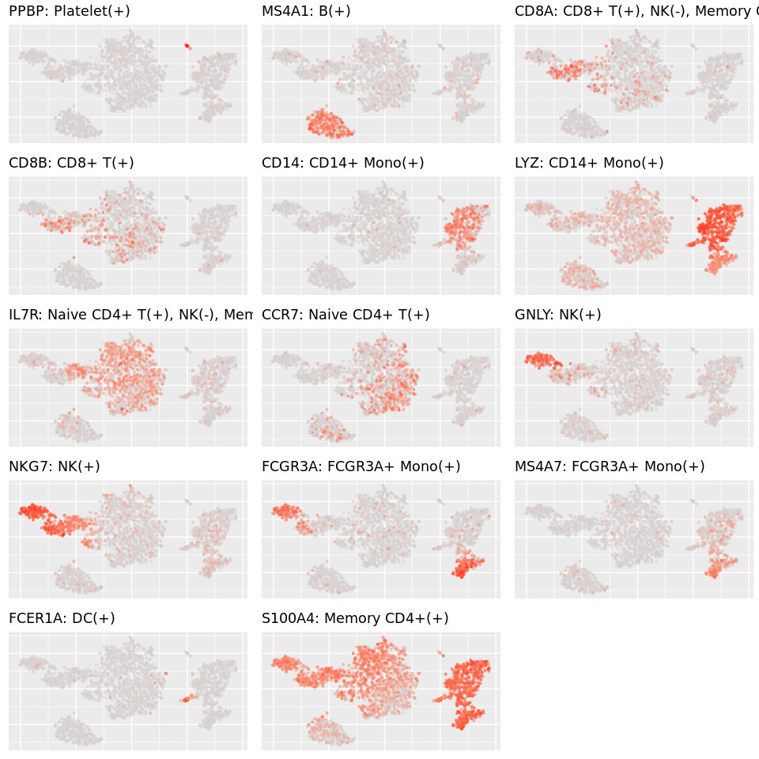

Annotation of PBMC3k with Seurat
================

This vignette shows annotation of PBMC3k dataset from the [Seurat
tutorial](https://satijalab.org/seurat/v3.0/pbmc3k_tutorial.html)

``` r
library(CellAnnotatoR)
library(Seurat)
library(dplyr)
```

``` r
pbmc_data <- Read10X("../data/pbmc3k/filtered_gene_bc_matrices/hg19")
pbmc <- CreateSeuratObject(pbmc_data, project="pbmc3k", min.cells=3, min.features=200)
pbmc[["percent.mt"]] <- PercentageFeatureSet(pbmc, pattern = "^MT-")

pbmc <- subset(pbmc, subset = nFeature_RNA > 200 & nFeature_RNA < 2500 & percent.mt < 5) %>% 
  NormalizeData(verbose=F) %>% FindVariableFeatures(selection.method = "vst", nfeatures=2000, verbose=F) %>% 
  ScaleData(verbose=F) %>% RunPCA(features=VariableFeatures(.), verbose=F) %>% 
  RunTSNE(dims=1:10)
```

To run annotation we also need to estimate cell neighbor graph, and
clustering to improve quality. In general, to be able to detect small
populations high clustering resolution is
required.

``` r
pbmc <- FindNeighbors(pbmc, dims=1:10, verbose=F) %>% FindClusters(resolution=5, verbose=F)
DimPlot(pbmc, reduction = "tsne", label=T) + NoLegend()
```

<!-- -->

We need to extract required information from the Seurat object. Exact
fields may vary depending on preprocessing options you used.

``` r
cm <- pbmc@assays$RNA@counts
cm_norm <- Matrix::t(pbmc@assays$RNA@data)
graph <- pbmc@graphs$RNA_snn
emb <- pbmc@reductions$tsne@cell.embeddings
clusters <- setNames(pbmc@meta.data$seurat_clusters, rownames(pbmc@meta.data))
```

Now we can run annotation:

``` r
marker_path <- "../markers/pbmc.md"

clf_data <- getClassificationData(cm, marker_path)
ann_by_level <- assignCellsByScores(graph, clf_data, clusters=clusters)
```

And plot the annotation:

``` r
Idents(pbmc) <- ann_by_level$annotation$l1
DimPlot(pbmc, reduction = "tsne", label=T) + NoLegend()
```

<!-- -->

Let’s also plot marker expression per cluster to ensure that everything
is correct:

``` r
plotSubtypeMarkers("root", emb, cm_norm, clf_data, n.col=3)
```

<!-- -->
